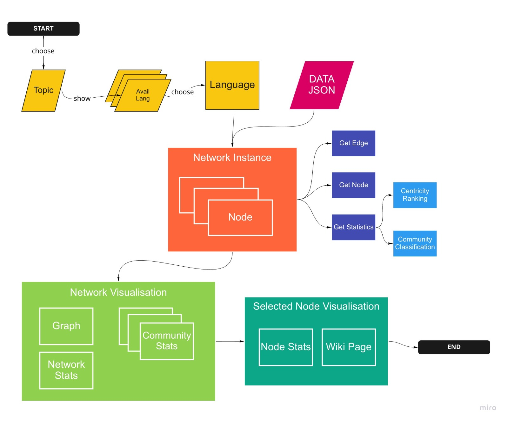

# Comparing Wikipedia Knowledge Networks
Application that compares networks of Wikipedia pagelinks around one topic across multiple languages. It shows different understandings of similar concepts - such as secularism, gender, terrorism - between language groups. 

The app consists of two parts: 
- fetch_data.py is a simple command line app to call the wikimedia API. 
- app.py is a Dash powered app to visualize and compare wikipedia pagelinks networks.  

The app uses the __Wikimedia API__ to download wikipage info, links and langlinks. Regarding API, see the Wikimedia API websites:
- https://www.mediawiki.org/wiki/API:Etiquette
- https://www.mediawiki.org/wiki/API:Query#Generators

The app uses __NetworkX__ to rank nodes and classify network communities. Eigenvector centrality measures are used for ranking nodes, and greedy modularity maximization to find network communities. Regarding these algorithms, see the networkX website: 
- https://networkx.org/documentation/stable/reference/algorithms/generated/networkx.algorithms.centrality.eigenvector_centrality.html?highlight=eigenvector%20centrality 
- https://networkx.org/documentation/stable/_modules/networkx/algorithms/community/modularity_max.html

The app uses __Dash__ for visualization of network graph and statistics. The graph visualization in dash draws on Cytoscape. For more information, please see the Dash website: 
- https://dash.plotly.com/
- https://dash.plotly.com/cytoscape

The app is under active development. 

## Requested features for app.
-------
1. Optimize visualization of graph and statistics. The app is still (very) slow, optimization is highest priority. 
2. Compare Network graphs of one page in two (or more) language side by side, also using isomorphism measures.

## Dependencies
-------


## Install
-------

```


```

## Screenshot
----------

<table><tr><td>

</td></tr></table>
