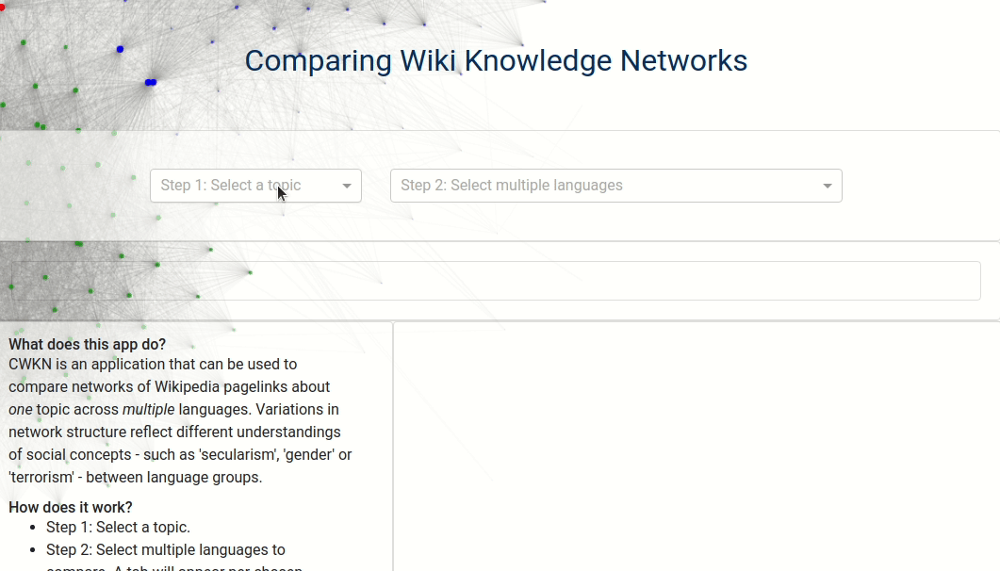
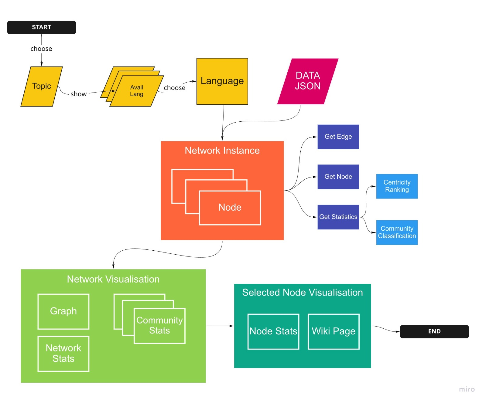

# Comparing Wikipedia Knowledge Networks
| Description                                                  | Visual                                                       |
| ------------------------------------------------------------ | ------------------------------------------------------------ |
| CWKN is an application that can be used to compare networks of Wikipedia page links about one topic across multiple languages. Variations in network structure reflect different understandings of social concepts - such as 'secularism', 'gender' or 'terrorism' - that go beyond linguistic translation. ||

The app consists of two parts: 
- app.py is a Dash powered app to visualise and compare Wikipedia page links networks. 
- fetch_data.py is a simple command line app to call the Wikimedia API. The app comes with a preloaded data set, but fetch_data.py can be used to add additional topics to this data set. 

This is a prototype app and under active development. Please note that it was the very first python script I wrote, and used as a learnign project. Comments, feature suggestions or bug reports are welcome.

## Installation

As the project is currently still under active development, the only way to run the app is to clone the repository. 

- Clone repository. 
- Resolve dependencies. 
- Run from your local directory. 

## Dependencies 

The app uses the __Wikimedia API__ to download Wikipedia page info, links and language links. Regarding API, see the Wikimedia API websites:

- https://www.mediawiki.org/wiki/API:Etiquette
- https://www.mediawiki.org/wiki/API:Query#Generators

The app uses __NetworkX__ to rank nodes and classify network communities. Eigenvector centrality measures are used for ranking nodes, and greedy modularity maximization to find network communities. Regarding these algorithms, see the networkX website: 
- https://networkx.org/documentation/stable/reference/algorithms/generated/networkx.algorithms.centrality.eigenvector_centrality.html?highlight=eigenvector%20centrality 
- https://networkx.org/documentation/stable/_modules/networkx/algorithms/community/modularity_max.html

The app uses __Dash__ for visualisation of network graph and statistics. The graph visualisation in dash draws on __Cytoscape__. For more information, please see the Dash website: 
- https://dash.plotly.com/
- https://dash.plotly.com/cytoscape

Full list of dependencies: 

- requests==2.22.0
- dash_table==4.12.0
- networkx==2.5
- dash==1.21.0
- dash_html_components==1.1.4
- dash_core_components==1.17.1
- dash_bootstrap_components==0.12.2
- pandas==1.2.3
- dash_cytoscape==0.2.0

## Workflow Dash app

| Description                                 | Visual                                                       |
| ------------------------------------------- | ------------------------------------------------------------ |
| The workflow of the Dash app is as follows: |  |

## Requested features for app.

1. Optimise visualisation of graph and statistics. Large graphs slowdown the app, optimisation is highest priority. 
2. Stability improvements are necessary. 
2. Improve user interaction: currently interaction between different elements in the app is one directional (selecting a node in graph, to get table with data). A node should also be selectable in a table to be highlighted in graph. 
3. Compare Network graphs of one page in two (or more) language side by side, also using isomorphism measures.
4. Imrprove use of network algorithms and explanation sociological relevance. 
4. Improve installation process.  
